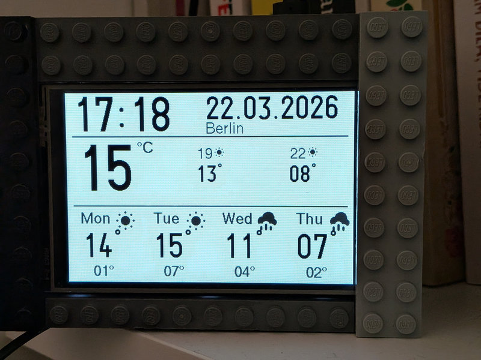

# Pico Weather Station



A weather dashboard for the Raspberry Pi Pico W, written in Rust using the Embassy framework. Displays current weather, hourly forecast, and multi-day forecast on a 3.5" LCD.

## Features

- Current temperature and city from online self-hosted API (via [geoip service](https://github.com/ljufa/geoip))
- Hourly temperature forecast for the current day
- 4-day weather forecast with high/low temperatures
- Real-time clock synchronized from the internet
- Automatic night mode (23:00–07:00): display inversion + PWM brightness dimming to 45%
- Partial screen refresh: only redraws changed regions (time, date, weather)
- WiFi credentials loaded from `.env` file at build time

## Hardware

### Required Components

- Raspberry Pi Pico W
- [Waveshare Pico-ResTouch-LCD-3.5](https://www.waveshare.com/wiki/Pico-ResTouch-LCD-3.5) (ILI9488, 480x320, 16-bit parallel via SPI shift registers)

### Pin Connections

- **ILI9488 Display:**
  - CLK: `GP10`
  - MOSI: `GP11`
  - CS: `GP9`
  - DC: `GP8`
  - RST: `GP15`
  - Backlight: `GP13` (PWM)

## Prerequisites

- **Rust:**
  ```sh
  curl --proto '=https' --tlsv1.2 -sSf https://sh.rustup.rs | sh
  ```
- **thumbv6m-none-eabi target:**
  ```sh
  rustup target add thumbv6m-none-eabi
  ```
- **probe-rs:**
  ```sh
  cargo install probe-rs --features cli
  ```

## Configuration

Copy the template and fill in your values:

```sh
cp .env.template .env
```

```sh
WIFI_SSID=your_network_name
WIFI_PASS=your_password
BRIGHTNESS_DAY=80        # display brightness during day (0–100%)
BRIGHTNESS_NIGHT=45      # display brightness at night (0–100%)
NIGHT_START=22           # night mode start hour (24h)
NIGHT_END=7              # night mode end hour (24h)
GEOIP_API_URL=http://your_geoip_service_ip_or_domain:8080
```

The `.env` file is loaded automatically at build time and is gitignored.

## Building and Running

### 1. Flash WiFi firmware (one-time, or after chip erase)

```sh
probe-rs download cyw43-firmware/43439A0.bin --binary-format bin --chip RP2040 --base-address 0x10100000
probe-rs download cyw43-firmware/43439A0_clm.bin --binary-format bin --chip RP2040 --base-address 0x10140000
```

### 2. Debug build (with defmt logging)

```sh
cargo make flash-debug
```

Or manually:
```sh
cargo run
```

### 3. Release build (no defmt, smaller binary, uses panic-reset)

```sh
cargo make flash-release
```

Or manually:
```sh
cargo build --release --no-default-features --features release
probe-rs download --chip RP2040 target/thumbv6m-none-eabi/release/pico_weather_station
```

### Build Features

| Feature   | Description                                      |
|-----------|--------------------------------------------------|
| `debug`   | Default. Includes defmt RTT logging, panic-probe |
| `release` | No logging, uses panic-reset for production      |

### Available Tasks (cargo-make)

| Task            | Description                              |
|-----------------|------------------------------------------|
| `flash-debug`   | Build, flash and attach debug serial     |
| `flash-release` | Build and flash release firmware         |
| `build-debug`   | Build debug only                         |
| `build-release` | Build release only                       |
| `check`         | Check for compilation errors             |

## Night Mode Testing

In `src/main.rs`, there is a `FORCE_NIGHT` constant to override the automatic time-based night mode:

```rust
const FORCE_NIGHT: Option<bool> = None;           // auto (time-based)
// const FORCE_NIGHT: Option<bool> = Some(true);   // force night
// const FORCE_NIGHT: Option<bool> = Some(false);  // force day
```
